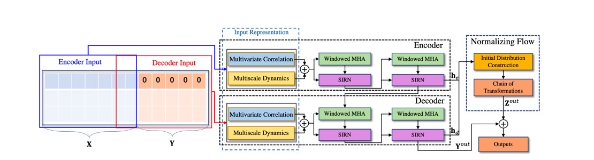
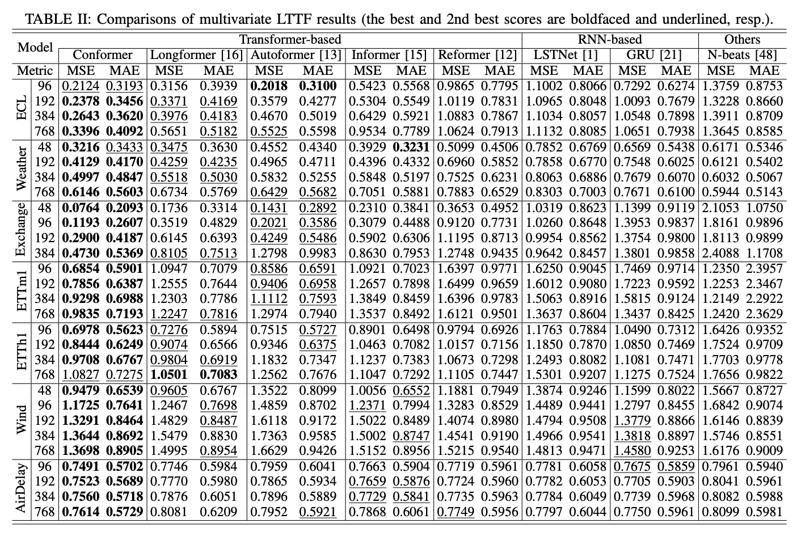
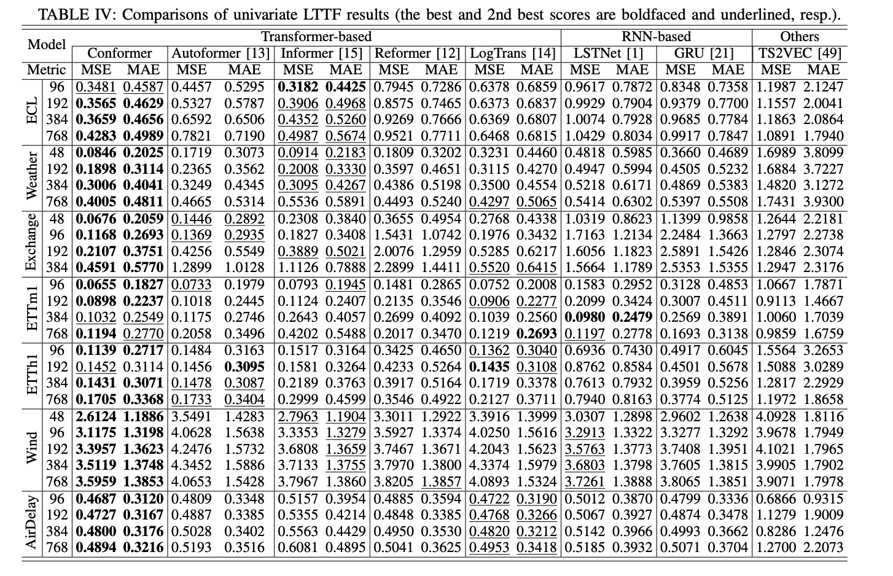
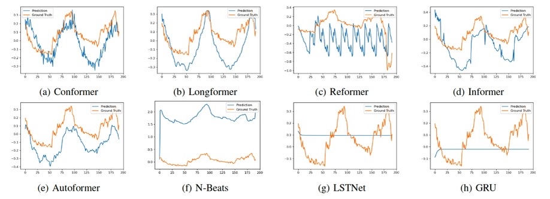

# This is an implementation of “Towards Long-Term Time-Series Forecasting: Feature, Pattern and Distribution ” under the pytorch environment. 

 We propose the transformer-based model 'Conformer' for long-term time series forecasting, the paper can be seen in https://arxiv.org/pdf/2301.02068.
 
#
【NOTE】
* In the implementation of paddle version, we use roughly the same experimental setup as the torch version,
so the performance will be different due to the differnece of framework.

* If you want to use this model under the paddle environment, the further tuning is required to achieve comparable 
performance as torch version.

* The model supports sliding-window attention and full attention, you can choose the attention type as needed.

* The installation of paddle can refer to [https://www.paddlepaddle.org.cn/documentation/docs/zh/install/index_cn.html].

## Requirement
* Python 3.6
* matplotlib == 3.1.1
* numpy == 1.19.4
* pandas == 0.25.1
* scikit_learn == 0.21.3
* paddlepaddle == 2.2.2

Dependencies should be installed using the following command before training:
`
pip install -r requirements.txt
`

## Data Prepare
   *Change the **$root_path** to your own data directory and **$data_path** to your dataset name to use this code quickly. This code only support **.csv** format now*
The public datasets used in this paper are listed as follows.

***Electricity:*** https://archive.ics.uci.edu/ml/datasets/ElectricityLoadDiagrams20112014

***Traffic:*** http://pems.dot.ca.gov

***Weather:*** https://www.bgc-jena.mpg.de/wetter/

***Exchange_rate*** https://github.com/laiguokun/multivariate-time-series-data

***ETTs:*** https://github.com/zhouhaoyi/ETDataset

***AirDelay:*** https://www.transtats.bts.gov

Except for the public time series datasets, we also used a collected Wind_Power dataset that you can find it under **data/wind.csv** in this repository.


## Usage
You can train the model of seven benchmark by the following commands, and the `--root_path` need to be set as your own path, and set `--pred_len` to change the prediction length.
```
# weather
python -u train.py  --data WTH --root_path $ --pred_len $
# electricity
python -u train.py  --data ECL --root_path $ --pred_len $
# exchange_rate
python -u train.py  --data EXCH --root_path $ --pred_len $
# ETTm1
python -u train.py  --data ETTm1 --root_path $ --pred_len $
# ETTh1
python -u train.py  --data ETTh1 --root_path $ --pred_len $
# Wind power
python -u train.py  --data elec --root_path $ --pred_len $
# AirDelay
python -u train.py  --data air --root_path $ --pred_len $
```

## The description of parameters

### The parameters of model architecture
The proposed 'Conformer' contains three main parts, the parameters of model architecture are as follows.
|Params|Description|
|:---|:---|
|--e_layers | number of encoder layer|
|--d_layers | number of decoder layer|
|--enc_lstm | number of lstm used in encoder|
|--dec_lstm | number of lstm used in decoder|
|--normal_layer | the number of normalizing flow layers|
|--d_model | the embedding dimension|
|--n_head | the number of attention head|
|--window | the window size of sliding window attention |
|--weight | the weight between the decoder output and normalizing flow results |

### Experiment settings
The parameters that used for experiments.
|Params|Description|
|:---|:---|
|--feature| forecasting tasks,including [M, S, MS] |
|--freq| frenquency of time series |
|--target | target feature when the forecasting task is MS or S |
|--seq_len | the length of input sequence |
|--label_len | token length of decoder input |
|--pred_len | the prediction length |
|--enc_in | the dimension of encoder input |
|--dec_in | the dimension of decoder input |
|--c_out | the dimension of output |
|--checkpoints | the path to save the checkpoints |
|--root_path | the root path of files |
|--data_path | the dataset path |

### Training settings 
The parameters that used for training the model.
|Params|Description|
|:---|:---|
|--learning_rate | the learning of optimizer |
|--batch_size | the batch size of input data |
|--train_epochs | the number of training epoch |
|--itr | the repeated experiment times |
|--loss | the loss function type |

## Experiment results
The multivariate forecasting results on six benchmark datasets.

The univariate forecasting results on six benchmark datasets.

The forecasting showcase when compare with other seven baseline methods.


## Citation 
```
@article{conformer,
author = {Li, Yan and Lu, Xinjiang and Xiong, Haoyi and Tang, Jian and Su, Jiantao and Jin, Bo and Dou, Dejing},
year = {2023},
month = {01},
title = {Towards Long-Term Time-Series Forecasting: Feature, Pattern, and Distribution}
}
```


